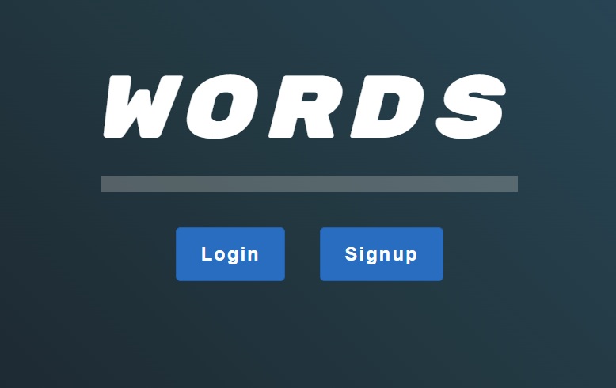
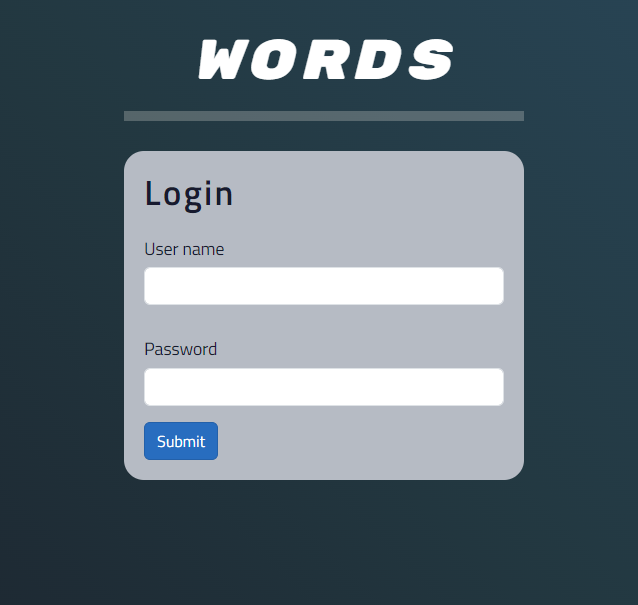
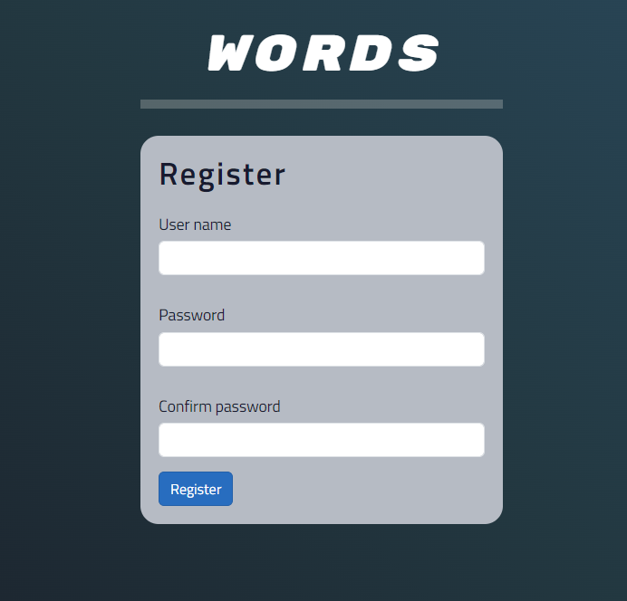
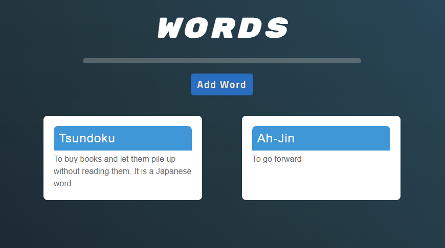
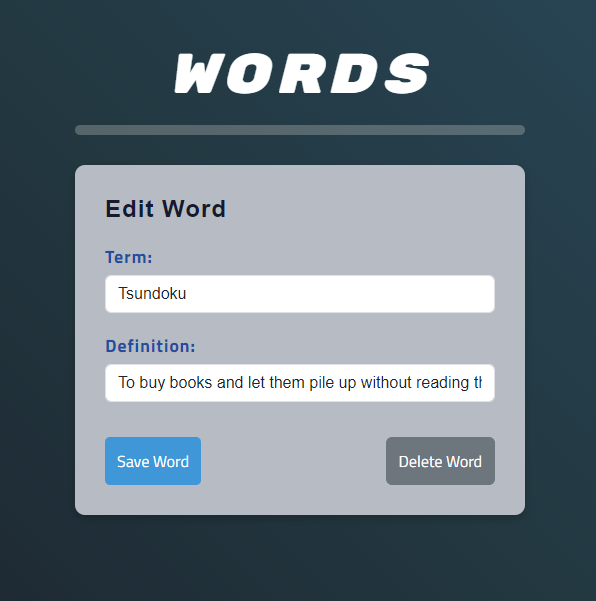
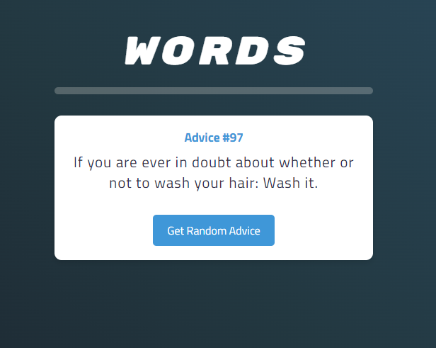
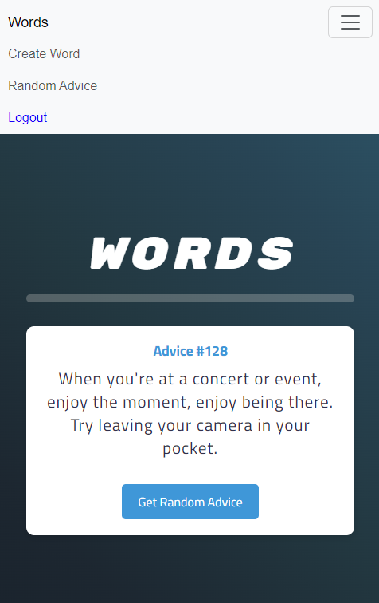

# Words Web App

Welcome to the Words Web App! This is a Blazor WebAssembly application that allows users to authenticate, store, and retrieve words they've learned.

## Table of contents

- [Features](#features)
- [Technologies Used](#technologies-used)
- [Getting Started](#getting-started)
- [Screenshots](#getting-started)

### Features

- **User Authentication:** Users can create accounts, log in, and securely access their personalized content.

- **Word Management:** Add, edit, and delete words with ease. Each word includes fields for the term and its definition.

- **Generate Randdom Advice:** Users can can generate random advice (If you need it).

### Technologies Used

- **Blazor WebAssembly:** The front-end framework used to build the interactive user interface.

- **C#:** The primary programming language for both client and server-side logic.

- **HTML/CSS:** The foundation for structuring and styling the web pages.

- **Bootstrap:** Used for responsive and visually appealing design components.

### Getting Started

To run the Words Web App locally, follow these steps:

1. Clone the repository: `git clone https://github.com/your-username/words-web-app.git`
2. Navigate to the project directory: `cd words-web-app`
3. Open the solution in your preferred IDE (e.g., Visual Studio, Visual Studio Code).
4. Build and run the application.

### Screenshot
| Images | Images |
| --- | --- |
|  |  |

|  |  |

|  |  |

